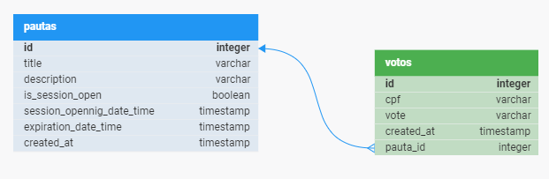

# Desafio Votação - Full Stack

Este é um projeto desenvolvido como parte de um desafio técnico para criar uma solução para dispositivos móveis que gerenciem e participem de sessões de votação em cooperativas. A solução foi implementada em Java, utilizando o framework Spring Boot para o backend e Javascript com a biblioteca React para o frontend.

👉 As instruções para este desafio foram propostas **[aqui](docs/INSTRUCOES_DEASAFIO.md)**

## Tecnologias Utilizadas

### Backend *(IDE: IntelliJ)*
- Java 17
- Spring Boot
- Maven
- PostgreSQL
- JUnit
- Mockito

### Frontend *(IDE: Visual Studio Code)*
- Javascript
- React
- Vite
- Ant Design
- Axios

## Modelagem de banco de dados

Para a modelagem do banco de dados fora considerada a existências de duas entidades a serem persistidas: **Pautas** e **Votos**. O controle de abertura e fechamento de sessão foi feito com a manipulação de atributos da entidade Pauta.



## Pré-requisitos

Para executar este projeto, é necessário ter instalado:

- JDK 17 ou superior
- Npm ou yarn
- PostgreSQL 16
- Git

## Como Executar o Projeto Localmente

Siga as instruções abaixo para executar o projeto localmente:

1. Abra o terminal em um diretório na sua máquina local e clone este repositório;
```
git clone https://github.com/tuliogontijo/votacao-react-java.git
```
2. Inicie o serviço postgreSQL e crie um datasource como nome "desafio_votacao";

### Backend

3. Navegue até o diretório do backend;
```
cd backend
```
4. Instale as dependências;
```
./mvnw clean install
```
5. Rode a aplicação
```
./mvnw springboot:app
```
- Se tudo estiver correto a aplicação Java Spring Boot estará disponível em http://localhost:8080 e o banco PostgreSQL na porta padrão 5432.

- Também é possível acessar a documentação e executar as requisições através do endereço: **http://localhost:8080/swagger-ui/index.html**

### Frontend

6. Navegue até o diretório do frontend
```
  cd ..
  cd frontend
```
7. Instale as dependências do projeto
```
  yarn
```
8. Rode o seguinte script pré-configurado pelo vite para rodar o projeto
```
  yarn dev
```

A aplicação rodará e estará acessível no seu localhost na porta padrão do vite: 5173 (http://localhost:5173)

## Funcionalidades da Aplicação

A aplicação oferece as seguintes funcionalidades:

- Cadastro de uma nova pauta
- Abertura de uma sessão de votação em uma pauta
- Recebimento de votos nas pautas (apenas 'Sim'/'Não')
- Contabilização dos votos e resultado da votação na pauta